# Milestone 2 IF3110 Pengembangan Aplikasi Berbasis Web

## Deskripsi Aplikasi Web

Aplikasi ini dibuat semacam clonning dari aplikasi Spotify, dimana penggunanya dapat mendengarkan lagu-lagu yang ada di dalam aplikasi dan melakukan subscription terhadap penyanyi premium. Aplikasi ini dibuat dengan menggunakan bahasa pemrograman Vanilla PHP, Vanilla JavaScript, HTML, CSS, dan MySQL.

## Daftar Requirement

1. Pengguna dapat melakukan login, register, dan logout
2. Admin dapat melakukan pengelolaan lagu serta album
3. Pengguna dapat melihat daftar lagu secara pagination dan memutarnya
4. Pengguna dapat melakukan search dan menerapkan filter maupun sort pada pencarian yang dilakukan
5. Pengguna dapat melihat daftar album, detail album, dan melihat lagu yang ada di dalam album tersebut serta detail dari lagu tersebut
6. Terdapat navigation bar pada setiap page
7. Admin dapat melihat daftar user yang terdaftar pada aplikasi
8. Admin dapat membuat, menghapus, dan mengubah lagu serta album yang ada di aplikasi
9. Pengguna dapat membuat permintaan subscription terhadap penyanyi premium.
10. Pengguna dapat melakukan eksplorasi nama penyanyi yang menyediakan lagu premium.

## Cara Menjalankan Server
> Perlu diperhatikan bahwa terdapat repository `sepotipayi-docker` untuk mempermudah menjalankan aplikasi secara sekaligus dan **disarankan** untuk menjalankan client melewati repository tersebut.

1. Pastikan docker desktop sudah dijalankan, disarankan untuk melakukan delete terlebih dahulu pada image MySQL yang sudah dimiliki sebelumnya
2. Jalankan perintah `docker-compose up --build`
3. Buka browser dan ketikkan `localhost:8008` pada address bar untuk melihat web yang dibuat

> Untuk melihat daftar port pada docker, jalankan perintah dapat dilihat pada aplikasi docker desktop sesuai dengan container yang dijalankan

## Screen Shot

### Login

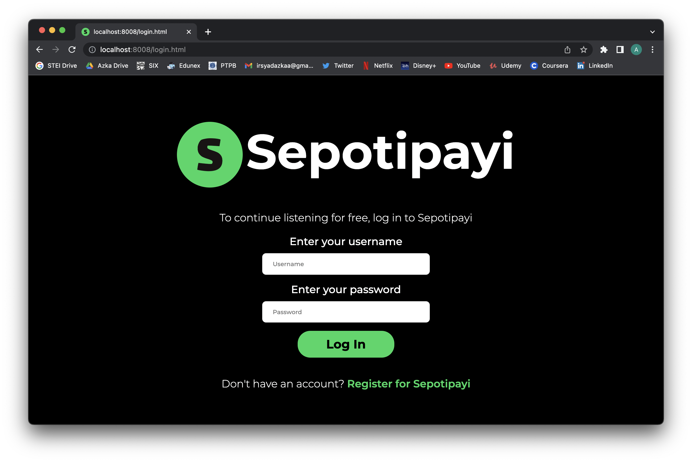

### Register
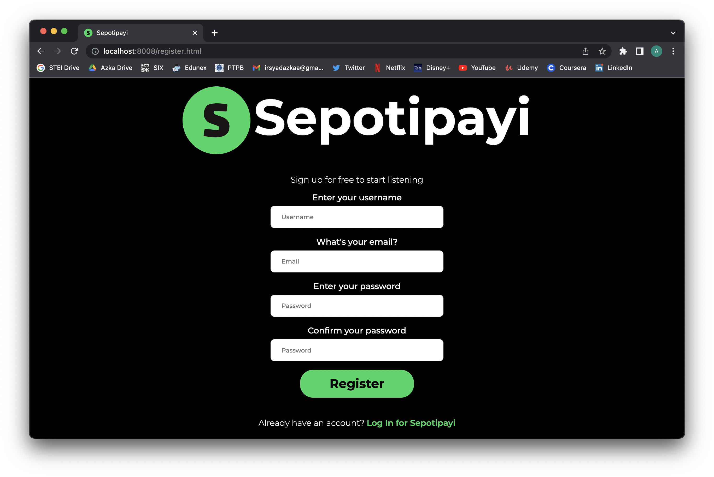

### Home
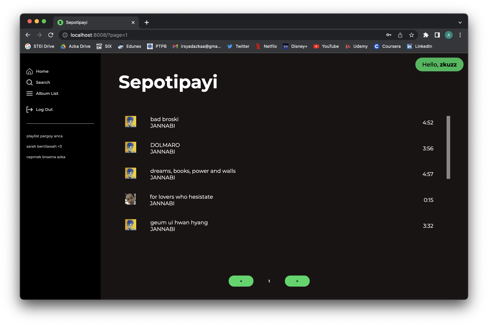

### Search
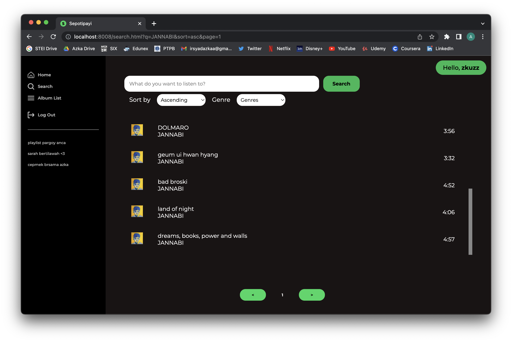

### Album List
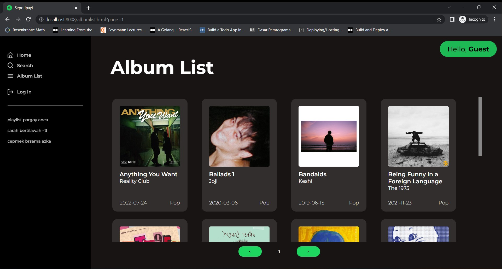

### Album Detail
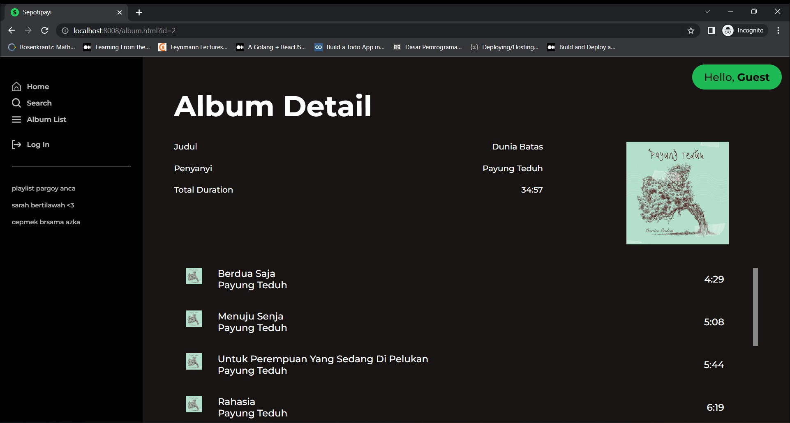

### Album Detail (Admin)
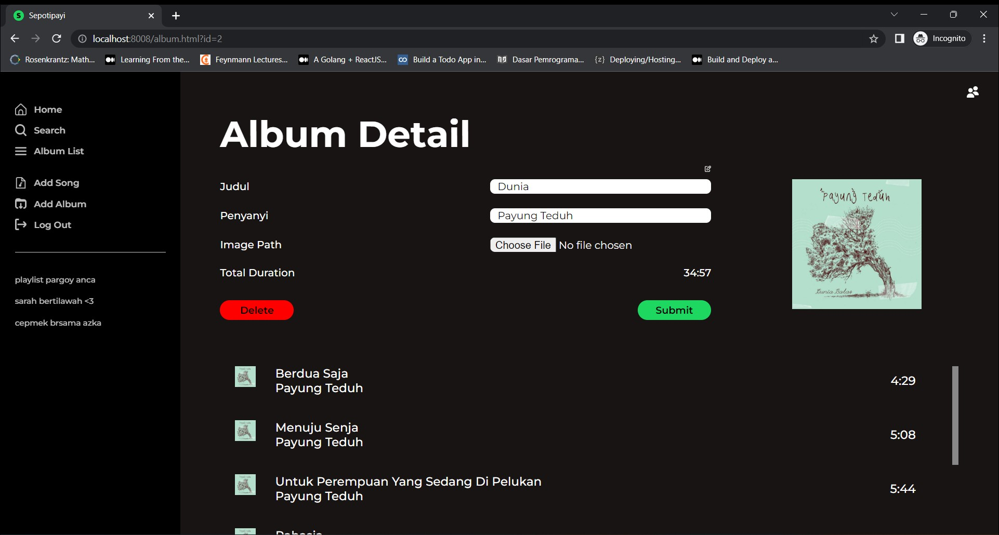

### Add Album
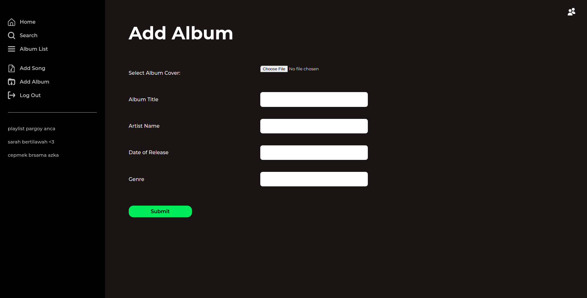

### Song Detail 
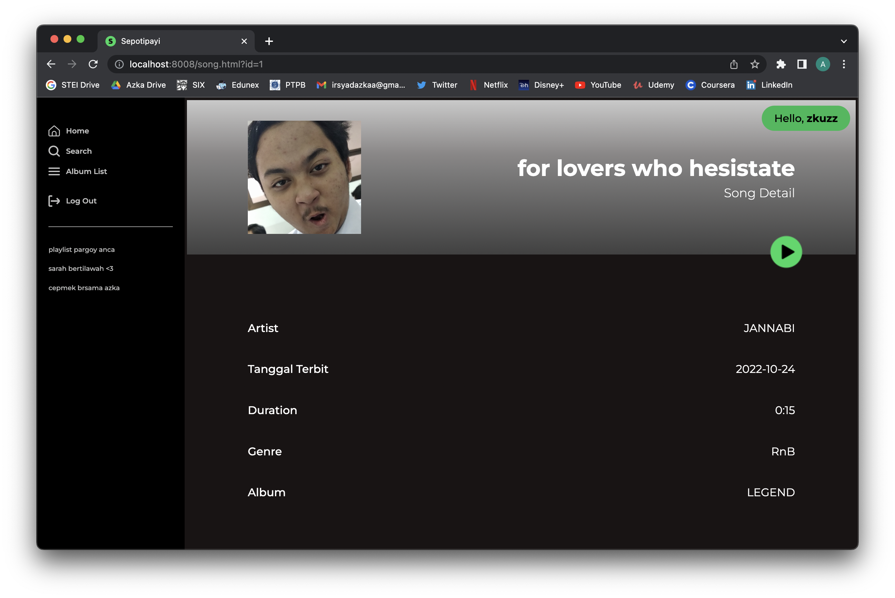

### Song Detail (Admin)
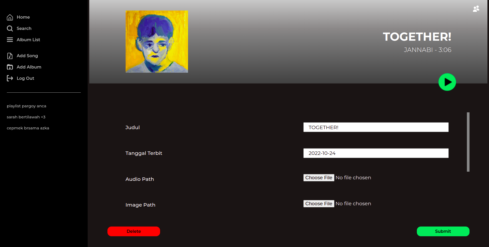

### Add Song
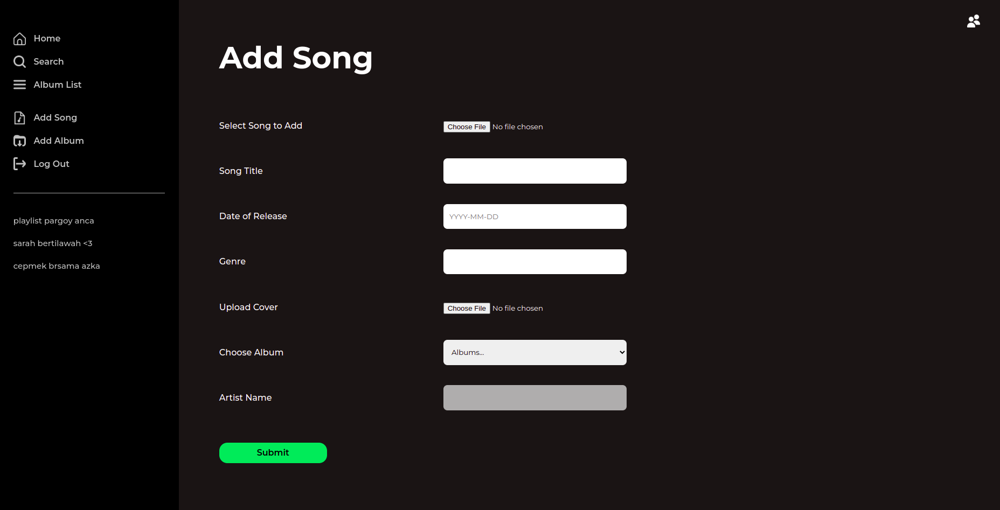

### Player
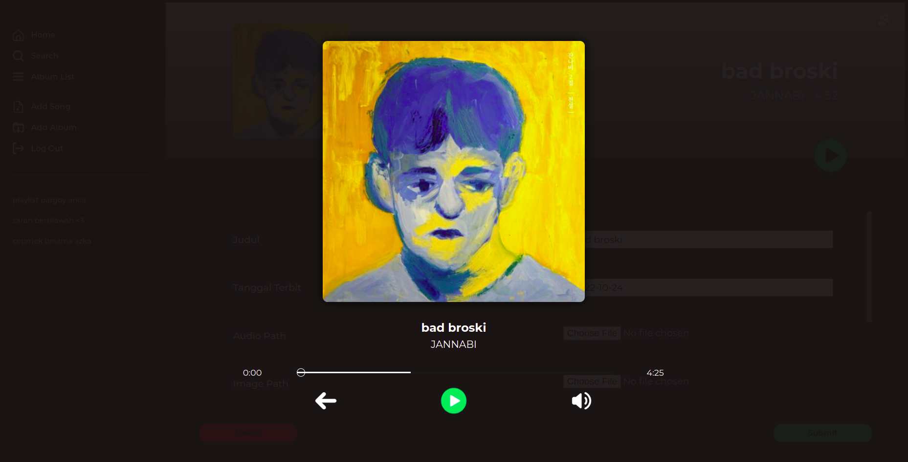

### User List (Admin)
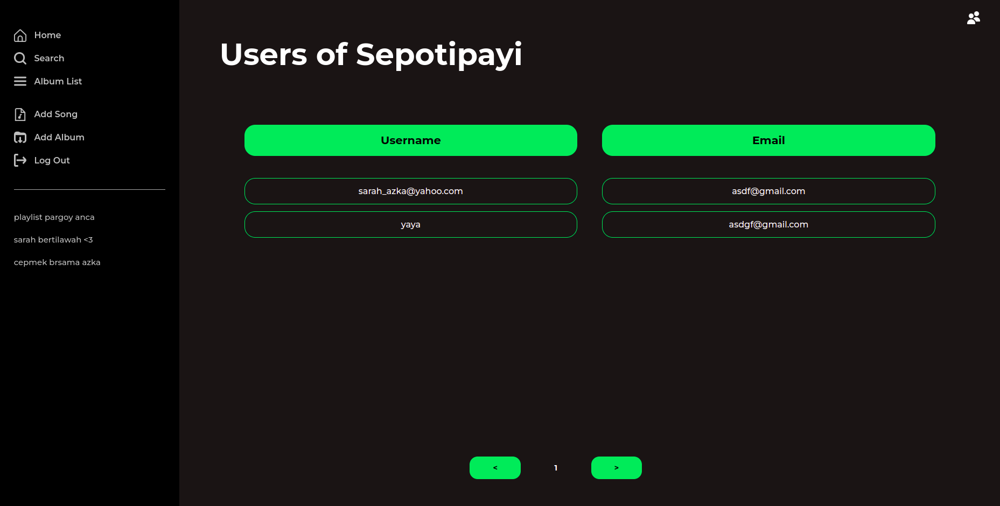

### Premium Song

### Premium Singer

## Pembagian Tugas

### FrontEnd
- Login: 13520083, 13520107
- Register: 13520083, 13520107
- Home: 13520044, 13520083, 13520107
- Search: 13520044, 13520107
- Album list: 13520083
- Album detail: 13520044, 13520107
- Song detail: 13520044, 13520083
- Add song: 13520083, 13520107
- Add album: 13520083, 13520107
- User list: 13520107
- Navbar: 13520044, 13520083, 13520107
- Player: 13520083
- Responsive: 13520083, 13520107
- Premium Song: 13520044, 13520083, 13520101
- Premium Singer: 13520044, 13520083, 13520101

### BackEnd
- Configuration: 13520044, 13520107
- Authentication: 13520107
- Album: 13520044, 13520083
- Song: 13520044, 13520083
- User list: 13520107
- Search: 13520044
- Pagination: 13520044
- Premium Song: 13520044, 13520083, 13520101
- Premium Singer: 13520044, 13520083, 13520101